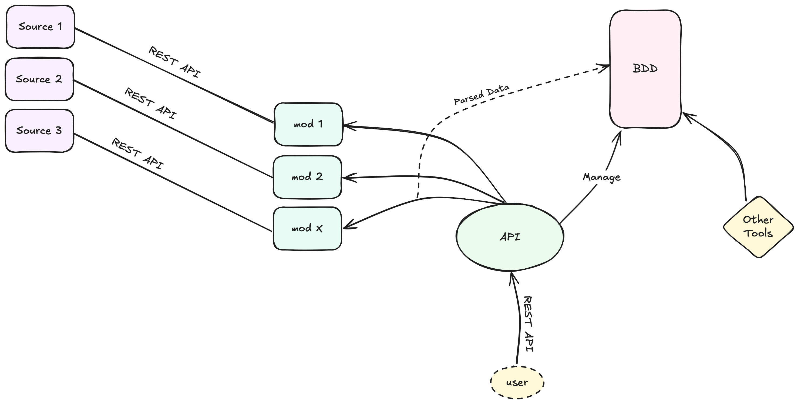

# BlackBunny

Call and store data in a centralised place from multiple sources.

# Why ?
I need to centralise all my tools and scripts in one place, so I can easily access them from anywhere.
I also want to keep data in cache for faster access.

# How ?

Main api got modules, each module is connected to a remote data source. Modules is an abstraction layer to access data from remote sources.
Module also provide a parser to parse data from remote source to a common format. This parser will be used to store data in a clickhouse database.